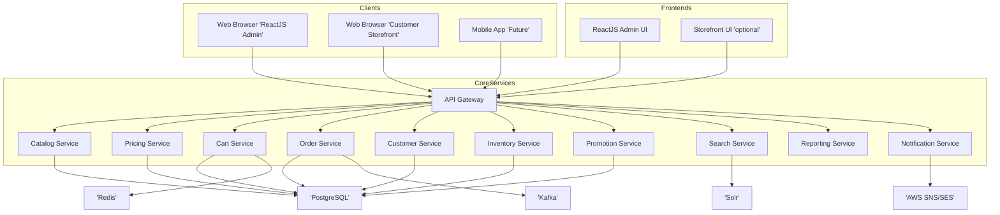

# 📘 Phase 1 – Solution Architecture

------

## 🟢 1️⃣ Architectural Goals

**Primary Objectives:**

- Modular, microservices-based e-commerce platform.
- Clear separation of concerns (catalog, pricing, order, inventory).
- API-first design to support:
  - Web frontend
  - Future mobile apps
  - External integrations
- Kubernetes-native deployment.
- Security and observability built-in.

------

## 🟢 2️⃣ Component Overview

Below is the **logical decomposition** of the solution:

| #    | Service/Component        | Responsibility                                               |
| ---- | ------------------------ | ------------------------------------------------------------ |
| 1    | **API Gateway**          | Single entry point for all client and integration calls (routing, authentication, rate limiting). |
| 2    | **Catalog Service**      | Product data, categories, inventory levels.                  |
| 3    | **Pricing Service**      | Base prices, campaign prices, discount logic.                |
| 4    | **Cart Service**         | Shopping carts, session management.                          |
| 5    | **Order Service**        | Order lifecycle, reservations, fulfillment tracking.         |
| 6    | **Customer Service**     | Customer profiles, addresses, preferences.                   |
| 7    | **Inventory Service**    | Stock tracking, location quantities.                         |
| 8    | **Promotion Service**    | Campaigns, coupons, time-bound discounts.                    |
| 9    | **Search Service**       | Product search, Solr integration.                            |
| 10   | **Reporting Service**    | Custom reporting APIs for ReactJS admin.                     |
| 11   | **Notification Service** | Email/SMS notifications via AWS/Firebase.                    |
| 12   | **Admin UI**             | React-based back office portal.                              |
| 13   | **Storefront UI**        | (Optional) Sample storefront frontend.                       |
| 14   | **Database**             | PostgreSQL cluster (transactional data).                     |
| 15   | **Search Index**         | Solr container for search data.                              |
| 16   | **Redis**                | Caching.                                                     |
| 17   | **Kafka**                | Event messaging between services.                            |

------

## 🟢 3️⃣ Solution Architecture Diagram

Here is a **Mermaid diagram** showing the big picture:

------

## 🟢 4️⃣ Interaction Flows

**Example Flow: Customer Places Order**

1. Customer browses catalog via API Gateway → Catalog Service.
2. Adds items to cart via Cart Service.
3. Pricing Service computes final price.
4. Customer Service identifies profile/address.
5. Order Service creates order, reserves inventory.
6. Inventory Service decrements stock.
7. Notification Service sends confirmation email.
8. Reporting Service logs transaction for admin reporting.

------

## 🟢 5️⃣ Security Overview

**Authentication/Authorization:**

- All external calls pass through API Gateway.
- JWT tokens (OAuth2) validate user sessions.
- Role-based access (admin vs. customer) enforced in API Gateway and services.

**Service-to-Service Security:**

- mTLS between microservices in Kubernetes.
- Internal services authenticated with service accounts.

**Secrets Management:**

- Kubernetes Secrets for DB credentials, API keys.

------

## 🟢 6️⃣ Deployment Topology

**Development:**

- Docker Compose for all services.
- Local PostgreSQL, Solr, Redis, Kafka.

**QA/Production:**

- Kubernetes (AWS EKS).
- Helm charts per service.
- RDS PostgreSQL.
- Solr managed cluster.
- AWS SNS/SES for notifications.

------

## 🟢 7️⃣ Observability

**Logging:**

- Each microservice logs to stdout → Fluent Bit → Elasticsearch.

**Metrics:**

- Prometheus scrapes metrics endpoints.
- Grafana dashboards.

**Tracing:**

- OpenTelemetry + Jaeger for distributed traces.

------

## 🟢 8️⃣ Key Design Considerations

- **Extensibility:** Microservices allow adding future modules (payments, ERP integrations).
- **Scalability:** Services can scale independently.
- **Simplicity:** For initial phase, disable unused services (e.g., B2B, complex workflows).
- **Alignment:** Development and production environments are as similar as possible.

------

✅ **Phase 1 Deliverables:**

- Component list ✅
- Architecture diagram ✅
- Interaction flows ✅
- Security overview ✅
- Deployment plan ✅
- Observability approach ✅

# 🟢 9️⃣ Off-the-Shelf vs. Custom Development Matrix

| #    | Component / Module       | Off-the-Shelf (Broadleaf) | Custom Development by Our Team | Notes                                                        |
| ---- | ------------------------ | ------------------------- | ------------------------------ | ------------------------------------------------------------ |
| 1    | **API Gateway**          | ✅ Provided                | Minor custom config            | Mostly Broadleaf Spring Cloud Gateway; you’ll configure routing and security policies. |
| 2    | **Catalog Service**      | ✅ Provided                | None                           | Standard catalog management included.                        |
| 3    | **Pricing Service**      | ✅ Provided                | None                           | Base price and promotions engine built-in.                   |
| 4    | **Cart Service**         | ✅ Provided                | None                           | Fully implemented in Broadleaf.                              |
| 5    | **Order Service**        | ✅ Provided                | None                           | Standard order lifecycle management included.                |
| 6    | **Customer Service**     | ✅ Provided                | None                           | Basic customer profiles and accounts included.               |
| 7    | **Inventory Service**    | ✅ Provided                | None                           | Sufficient for basic stock tracking.                         |
| 8    | **Promotion Service**    | ✅ Provided                | None                           | Campaigns, coupons, time-based promotions included.          |
| 9    | **Search Service**       | ✅ Provided                | Minimal config                 | Solr setup and configuration will be done by you.            |
| 10   | **Notification Service** | ⚠️ Partially Provided      | ✅ Developed by us              | Broadleaf includes email templates, but you will integrate with AWS SNS/SES and potentially Firebase. |
| 11   | **Reporting Service**    | ❌ Not Provided            | ✅ Developed by us              | Custom reporting APIs (REST) to power the ReactJS admin dashboard. |
| 12   | **Admin UI**             | ✅ Provided                | Minor customizations           | React Admin UI included; you’ll customize branding and forms. |
| 13   | **Storefront UI**        | ⚠️ Optional Accelerator    | ✅ Likely developed by us       | Broadleaf offers reference React storefront, but you may build your own if needed. |
| 14   | **Database**             | ✅ Provided schema         | Managed by you                 | Schema is defined; you provision and maintain the DB.        |
| 15   | **Search Index (Solr)**  | ✅ Provided integration    | Config & deploy                | Solr configuration and maintenance by you.                   |
| 16   | **Redis**                | ✅ Used internally         | Config & deploy                | Redis is required for caching; you provision.                |
| 17   | **Kafka**                | ✅ Event architecture      | Config & deploy                | Kafka required for events; you provision and operate.        |

------

## 🟢 10️⃣ Summary of Development Responsibilities

✅ **Off-the-Shelf (Broadleaf):**

- Core microservices: Catalog, Cart, Order, Pricing, Promotions, Customer.
- API Gateway with Spring Cloud Gateway.
- Base Admin UI.
- Search integration with Solr.

✅ **Custom Development by Your Team:**

- **Notification Service:**
  - Implement custom integration with AWS SNS/SES for transactional emails/SMS.
- **Reporting Service:**
  - Build custom REST APIs to deliver sales, inventory, and campaign reports.
- **ReactJS Reporting Frontend:**
  - Lightweight admin dashboard consuming your reporting APIs.
- **Optional Storefront:**
  - Either extend the reference React Storefront or build your own.
- **Infrastructure:**
  - Docker Compose, Kubernetes manifests, Helm charts.
  - Observability stack (Prometheus, Grafana, Jaeger).
- **DevOps Automation:**
  - CI/CD pipelines in GitHub Actions.
- **Security Configuration:**
  - OAuth2/JWT setup and mTLS between microservices.

------

## 🟢 11️⃣ Recommendation

This approach ensures:

- **80% of functionality off the shelf**.
- Your team focuses **only on integrations, reporting, and operational excellence**.
- No duplicated efforts.

# 🟢 Storefront UI Decision

**Decision:**
 👉 We will **use Broadleaf’s freely available Storefront UI (React reference implementation)**.

**Implication:**
 ✅ No need to develop a custom storefront frontend for this phase.
 ✅ We will only **configure, style, and possibly do minor adjustments**.
 ✅ Focus remains on:

- Reporting API and admin reporting UI.
- Notification service integration.
- Infrastructure and deployment.