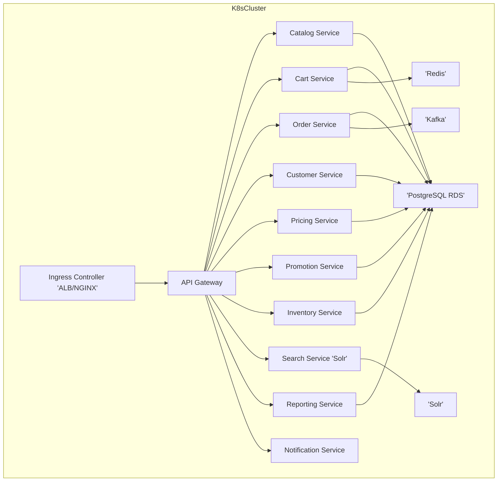

# 📘 **Phase 2 – Environment & Deployment Design**

------

## 🟢 1️⃣ Goals of Phase 2

- Enable **smooth local development** that mirrors production as much as possible.
- Define **Docker Compose setup** for developers.
- Define **Kubernetes deployment strategy** for QA / PROD.
- Design **CI/CD pipeline approach** (GitHub Actions).
- Detail **secret management** and config management.
- Ensure **observability hooks** are in place from day 1.

------

## 🟢 2️⃣ Local Development Environment

| Aspect                      | Details                                                      |
| --------------------------- | ------------------------------------------------------------ |
| **Platform**                | Developer machines (Docker Desktop or Linux Docker Engine, Minikube for K8s testing) |
| **Container Orchestration** | Docker Compose (for full Broadleaf microservices stack + supporting services) |
| **Main services**           | API Gateway, Catalog, Cart, Order, Customer, Pricing, Inventory, Promotions, Notification, Search, Reporting |
| **Infra services**          | PostgreSQL, Solr, Redis, Kafka                               |
| **Frontend**                | React Admin UI (off-the-shelf), React Storefront UI (off-the-shelf) |
| **Tooling**                 | Eclipse IDE, Postman/Swagger for API testing, Jaeger for tracing |
| **Observability**           | Prometheus, Grafana, FluentBit + ELK stack for logs          |
| **Secrets/config**          | .env files + Docker Compose env vars (no hardcoded secrets)  |


------

### Docker Compose Skeleton (example)

```yaml

services:
  api-gateway:
    image: broadleaf/api-gateway:latest
    ports:
      - "8080:8080"
    environment:
      - SPRING_PROFILES_ACTIVE=local
      - DB_HOST=postgres
    depends_on:
      - postgres

  postgres:
    image: postgres:14
    environment:
      POSTGRES_USER: broadleaf
      POSTGRES_PASSWORD: password
    volumes:
      - pg_data:/var/lib/postgresql/data

  solr:
    image: solr:8
    # solr setup details

  redis:
    image: redis:6

  kafka:
    image: bitnami/kafka:latest
    # kafka setup details

volumes:
  pg_data:
```

➡ Full Compose file will have all services.

------

## 🟢 3️⃣ Kubernetes Deployment (QA / PROD)

| Aspect                 | Details                                                      |
| ---------------------- | ------------------------------------------------------------ |
| **Cluster platform**   | AWS EKS                                                      |
| **Service deployment** | Helm charts per microservice                                 |
| **Ingress**            | AWS ALB Ingress Controller or NGINX Ingress                  |
| **Config management**  | ConfigMaps (for non-sensitive config), Secrets (for DB credentials, API keys) |
| **Storage**            | AWS EBS volumes for PostgreSQL, Solr (if self-managed)       |
| **Observability**      | Prometheus Operator, Grafana, OpenTelemetry sidecars or agents |
| **Scaling**            | HPA (Horizontal Pod Autoscaler) for API Gateway, Catalog, Order |
| **Security**           | mTLS between services, IAM roles for K8s service accounts (e.g., for S3 access) |


------

### Kubernetes Topology (Mermaid)



------

## 🟢 4️⃣ CI/CD Pipeline (GitHub Actions)

| Stage                  | Action                                                   |
| ---------------------- | -------------------------------------------------------- |
| **Build**              | Build microservice Docker images, run unit tests         |
| **Push**               | Push to Amazon ECR                                       |
| **Deploy QA**          | GitHub Actions triggers Helm upgrade on QA cluster       |
| **Test QA**            | Run integration tests                                    |
| **Deploy PROD**        | Manual approval → Helm upgrade on PROD                   |
| **Observability hook** | Emit deployment events for Prometheus/Grafana dashboards |


------

## 🟢 5️⃣ Config & Secret Management

| Type       | Approach                                                     |
| ---------- | ------------------------------------------------------------ |
| Config     | Kubernetes ConfigMaps for env-specific config (URLs, feature flags) |
| Secrets    | Kubernetes Secrets (base64-encoded, can integrate with AWS Secrets Manager later) |
| Deployment | No hardcoded secrets in images or code; all via env vars or mounted files |


------

## 🟢 6️⃣ Local / Prod Parity

✅ **Local mirrors prod**

- Same service list (Docker Compose == K8s Helm deployments)
- Same DB engine (Postgres)
- Same API Gateway configs (profiles for local vs. prod)
- Same observability tooling stack (Prometheus, Grafana, OpenTelemetry)

------

## 🟢 7️⃣ Observability (Connected to Phase 6 too)

- Prometheus + Grafana (metrics)
- Fluent Bit + Elasticsearch (logs)
- Jaeger (tracing)
- Health endpoints on all services (`/actuator/health`)

------

## 🟢 Summary of Phase 2 Deliverables

✅ Docker Compose design
 ✅ Kubernetes deployment plan
 ✅ CI/CD pipeline structure
 ✅ Config + secret management approach
 ✅ Observability plan