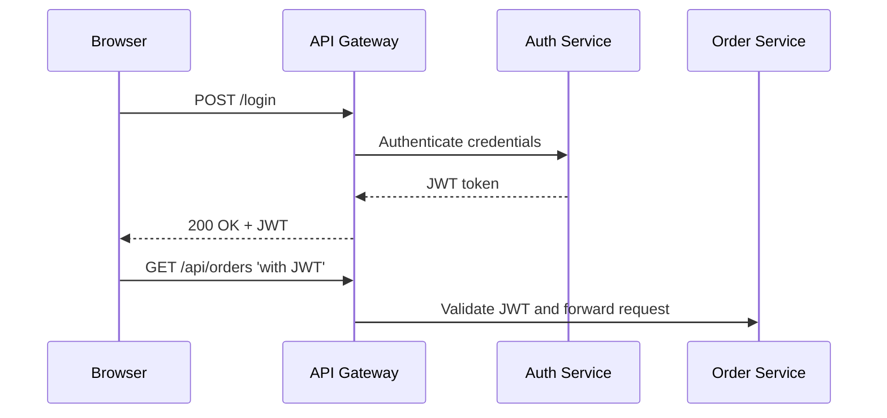

# 📘 Phase 4 – Security Design

Let’s maintain the same **structured, clear approach** to avoid surprises.

------

## 🟢 1️⃣ Security Objectives

Your security model must:

- Protect **customer data** and **business-sensitive data**.
- Ensure **only authenticated and authorized users** access APIs.
- Secure **service-to-service traffic** in Kubernetes.
- Enable **traceability and auditability**.

------

## 🟢 2️⃣ Security Model Overview

| Layer                          | Security Approach                                            |
| ------------------------------ | ------------------------------------------------------------ |
| **External Clients**           | OAuth2 JWT tokens (Authorization Code flow for Admin UI, Resource Owner Password flow for Storefront) |
| **API Gateway**                | Validates tokens, enforces roles and rate limits             |
| **Microservices**              | Enforce additional role checks, protect sensitive operations |
| **Service-to-Service Traffic** | mTLS between pods in Kubernetes                              |
| **Secrets**                    | Kubernetes Secrets + AWS IAM roles for service credentials   |
| **Data at Rest**               | Encrypted (PostgreSQL encryption at rest)                    |
| **Data in Transit**            | TLS 1.2+ for all endpoints                                   |

------

## 🟢 3️⃣ Identity & Access Management

✅ **User Types**

| User Type            | Authentication Method               | Roles         |
| -------------------- | ----------------------------------- | ------------- |
| **Customer**         | Username/password + JWT (login API) | ROLE_CUSTOMER |
| **Admin User**       | OAuth2 Authorization Code flow      | ROLE_ADMIN    |
| **Service Accounts** | Kubernetes ServiceAccount + mTLS    | ROLE_SERVICE  |

✅ **Token Management**

- Token lifetimes configurable (e.g., 1 hour access tokens, 7 days refresh tokens).
- Short-lived JWTs preferred for microservices.
- Admin UI uses secure cookie storage for tokens.

✅ **Key Rotation**

- JWT signing keys rotated periodically.
- Old keys retained temporarily for validation.

------

## 🟢 4️⃣ OAuth2 Flows

✅ **Customer Authentication Flow (Storefront)**

✅ **Admin Authentication Flow**

- OAuth2 Authorization Code Flow with Broadleaf Admin UI:
  1. Admin UI redirects to Auth Service login.
  2. User authenticates.
  3. Auth Service issues authorization code.
  4. Admin UI exchanges code for JWT + refresh token.

------

## 🟢 5️⃣ API Gateway Responsibilities

- Enforce **SSL/TLS** (no HTTP fallback).
- Validate JWT signature & expiration.
- Check scopes/roles for access control.
- Rate-limit per user/IP.
- Log security events (auth success/failure).

------

## 🟢 6️⃣ Microservices Security

- Each microservice verifies incoming JWT scopes/roles.
- Sensitive endpoints (e.g., price adjustments) require `ROLE_ADMIN`.
- Service-to-service calls include JWT and mutual TLS.
- Example: Cart Service calls Pricing Service with signed JWT from API Gateway.

------

## 🟢 7️⃣ mTLS Service Mesh

| Aspect                   | Approach                                        |
| ------------------------ | ----------------------------------------------- |
| **Platform**             | Kubernetes cert-manager or Istio mTLS           |
| **Certificate Issuance** | Automatic per pod/service                       |
| **Rotation**             | Automated                                       |
| **Validation**           | Pod identity verified before accepting requests |

------

## 🟢 8️⃣ Secrets Management

| Type             | How Managed                             |
| ---------------- | --------------------------------------- |
| DB Passwords     | Kubernetes Secrets (encrypted)          |
| AWS Credentials  | IAM roles for ServiceAccounts (IRSA)    |
| JWT Signing Keys | Kubernetes Secrets or Vault integration |
| SMTP Credentials | Kubernetes Secrets                      |

✅ **Guidelines:**

- No credentials in Docker images or code.
- No plaintext logs of secrets.
- Use environment variables or mounted volumes.

------

## 🟢 9️⃣ Data Protection

| Area           | Protection Strategy                                          |
| -------------- | ------------------------------------------------------------ |
| **At Rest**    | PostgreSQL encryption at rest, Solr encryption, EBS encryption |
| **In Transit** | TLS 1.2+ everywhere                                          |
| **Backups**    | Encrypted snapshots                                          |
| **PII Data**   | Masking in logs, audit access to tables                      |

------

## 🟢 10️⃣ Audit & Monitoring

✅ **Audit Trails:**

- Log all logins, failed logins, role changes, password resets.
- Sensitive actions (order refunds, price overrides) logged with user identity.

✅ **Monitoring:**

- Alert on:
  - Excessive failed login attempts.
  - Role escalation events.
  - Suspicious API patterns.
- Metrics exported to Prometheus.

------

## 🟢 11️⃣ Deliverables for Phase 4

✅ Security model & user roles
 ✅ OAuth2 and JWT flows
 ✅ API Gateway security responsibilities
 ✅ Microservice role enforcement
 ✅ mTLS plan
 ✅ Secrets management approach
 ✅ Data protection measures
 ✅ Audit requirements